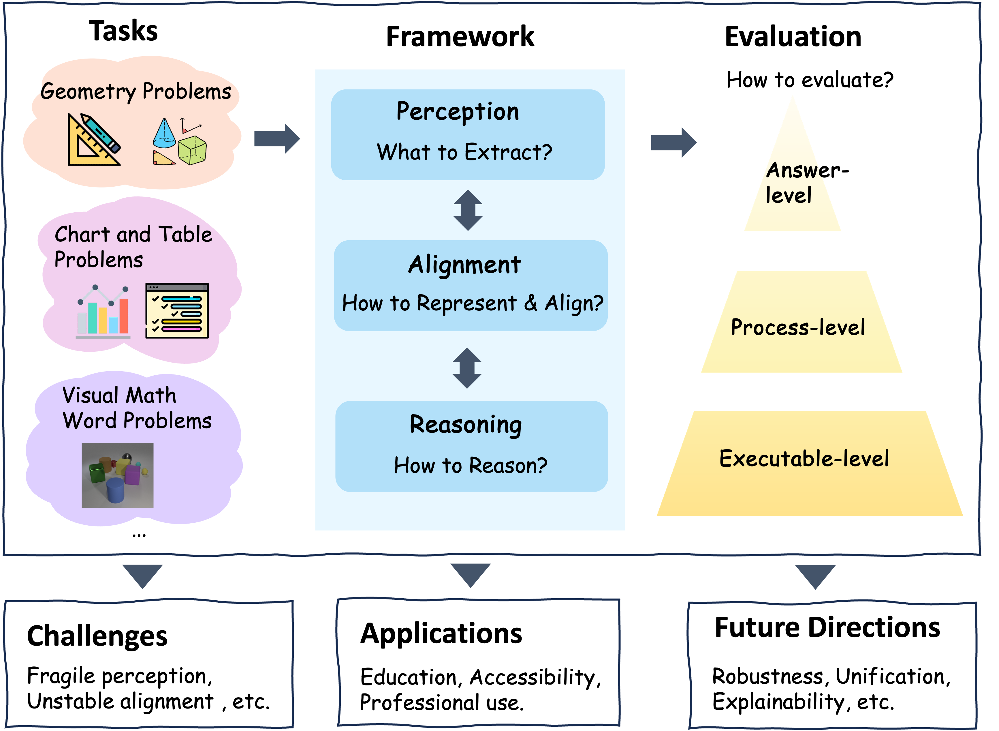

# Awesome Multimodal Mathematical Reasoning:       👀Perception - 🔗Alignment - 🧠Reasoning 

# [](https://awesome.re) [](https://arxiv.org/abs/2603.08291)

<p align="center">  </p>

Official paper list for our paper **[Deconstructing Multimodal Mathematical Reasoning: Towards a Unified Perception-Alignment-Reasoning Paradigm](https://arxiv.org/abs/2603.08291)**.

This repository is organized around the 👀**Perception - 🔗Alignment - 🧠Reasoning (PAR)** framework and the ✅**Answer - 🪜Process - ⚙️Executable (APE)** evaluation hierarchy introduced in our survey.

## ✨ Highlights

- Organized by **PAR**: **Perception**, **Alignment**, and **Reasoning**
- Covers major MMR task families: **Geometry**, **Chart/Table Reasoning**, and **Visual Math Word Problems**
- Includes **method papers**, **datasets**, **benchmarks**, and **related surveys**
- Emphasizes **accurate links**, **taxonomy-aware placement**, and **benchmark usability**

---

## 🗂️ Quick Navigation

- [📌 What is MMR?](#-what-is-mmr)
- [🧭 Our Taxonomy](#-our-taxonomy)
  - [PAR: Perception - Alignment - Reasoning](#par-perception---alignment---reasoning)
  - [APE: Answer - Process - Executable](#ape-answer---process---executable)
- [🧩 Task Families](#-task-families)
  - [Geometry](#geometry)
  - [Chart and Table Reasoning](#chart-and-table-reasoning)
  - [Visual Math Word Problems](#visual-math-word-problems)
- [📚 Paper List by PAR](#-paper-list-by-par)
  - [👀 Perception](#-perception)
  - [🔗 Alignment](#-alignment)
  - [🧠 Reasoning](#-reasoning)
  - [🧪 Supervision and Data for Reasoning](#-supervision-and-data-for-reasoning)
- [🧮 Datasets and Benchmarks](#-datasets-and-benchmarks)
  - [Geometry Problems](#geometry-problems)
  - [Chart and Table Problems](#chart-and-table-problems)
  - [Visual Math Word Problems](#visual-math-word-problems-1)
  - [Process-level and Error-focused Benchmarks](#process-level-and-error-focused-benchmarks)
  - [Comprehensive MMR Benchmarks](#comprehensive-mmr-benchmarks)
- [📝 Related Surveys](#-related-surveys)
- [📎 Citation](#-citation)
- [💡 Notes](#-notes)

---

## 📌 What is MMR?

**Multimodal Mathematical Reasoning (MMR)** studies mathematical problem solving when crucial evidence is distributed across **text and visual modalities**, such as diagrams, charts, tables, scientific figures, or real-world visual scenes.

Compared with text-only mathematical reasoning, MMR introduces three tightly coupled challenges:

1. 👀 **Perception**: extracting computation-relevant visual facts
2. 🔗 **Alignment**: mapping these facts into symbolic, textual, or executable representations
3. 🧠 **Reasoning**: performing stable and verifiable multi-step inference over the aligned representations

This repository follows that **process-level** view rather than a flat list of benchmarks or models.

---

## 🧭 Our Taxonomy

### PAR: Perception - Alignment - Reasoning

#### 👀 Perception
Recover structured mathematical evidence from multimodal inputs, such as:
- geometric primitives, relations, and topology
- chart axes, legends, marks, and values
- table structure and numerical cells
- visual attributes, counts, and spatial correspondences in scenes

#### 🔗 Alignment
Bind perceived evidence to representations suitable for reasoning, such as:
- formal languages
- programs or code
- constraints and operator sequences
- proof sketches
- SQL queries
- structured multimodal latent representations

#### 🧠 Reasoning
Perform reliable multi-step inference through:
- chain-of-thought reasoning
- search and planning
- reinforcement learning
- tool-augmented reasoning
- verifier-guided or process-reward-guided reasoning

### APE: Answer - Process - Executable

This is an **evaluation taxonomy introduced in our survey**, not a standalone paper list. We keep it here because it organizes how MMR systems are evaluated. To make the section more concrete, we include representative benchmarks below.

#### ✅ Answer
Evaluate final correctness only. Representative benchmarks: **ChartQA**, **PlotQA**, **IconQA**, **FinQA**, **TAT-QA**.

#### 🪜 Process
Evaluate the faithfulness and validity of intermediate reasoning steps. Representative benchmarks: **MM-MATH**, **MPBench**, **ErrorRadar**, **We-Math**, **MathVerse**.

#### ⚙️ Executable
Evaluate reasoning through execution, proof checking, program verification, or formal validation. Representative benchmarks: **GeoQA+**, **Geometry3K**, **E-GPS**, **FormalGeo**, **WikiSQL**.

---

## 🧩 Task Families

### Geometry
Problems requiring joint understanding of **text + diagrams**, often involving primitives, metric relations, theorem application, symbolic formalization, and proof generation.

### Chart and Table Reasoning
Problems requiring models to interpret **charts, tables, documents, or mixed layouts**, then perform numerical or logical reasoning.

### Visual Math Word Problems
Problems where mathematical reasoning depends on **visual scenes, icon diagrams, multi-image contexts, or semi-structured visual inputs**.

---

## 📚 Paper List by PAR

## 👀 Perception

### Geometry Perception

- [[GEOS]](https://aclanthology.org/D15-1171/) Solving Geometry Problems: Combining Text and Diagram Interpretation - EMNLP 2015
- [[GEOS++]](https://aclanthology.org/D17-1081/) From Textbooks to Knowledge: A Case Study in Harvesting Axiomatic Knowledge from Textbooks to Solve Geometry Problems - EMNLP 2017
- [[Inter-GPS]](https://aclanthology.org/2021.acl-long.528/) Inter-GPS: Interpretable Geometry Problem Solving with Formal Language and Symbolic Reasoning - ACL 2021
- [[GeoQA]](https://aclanthology.org/2021.findings-acl.46/) GeoQA: A Geometric Question Answering Benchmark Towards Multimodal Numerical Reasoning - ACL Findings 2021
- [[GeoQA+]](https://aclanthology.org/2022.coling-1.130/) An Augmented Benchmark Dataset for Geometric Question Answering through Dual Parallel Text Encoding - COLING 2022
- [[PGDP5K]](https://arxiv.org/abs/2205.09947) PGDP5K: A Diagram Parsing Dataset for Plane Geometry Problems - IJCAI 2022
- [[PGPS9K]](https://arxiv.org/abs/2302.11097) A Multi-Modal Neural Geometric Solver with Textual Clauses Parsed from Diagram - IJCAI 2023
- [[GeomVerse]](https://arxiv.org/abs/2312.12241) GeomVerse: A Systematic Evaluation of Large Models for Geometric Reasoning - ICML Workshop 2024
- [[G-LLaVA]](https://arxiv.org/abs/2312.11370) G-LLaVA: Solving Geometric Problem with Multi-Modal Large Language Model - arXiv 2023
- [[GeoGPT4V]](https://aclanthology.org/2024.emnlp-main.44/) GeoGPT4V: Towards Geometric Multi-modal Large Language Models with Geometric Image Generation - EMNLP 2024
- [[Diagram Formalization]](https://dblp.org/rec/conf/icassp/ZhangCDTMQZZL25.html) Diagram Formalization Enhanced Multi-Modal Geometry Problem Solver - ICASSP 2025
- [[GEOX]](https://openreview.net/forum?id=6RiBl5sCDF) GeoX: Geometric Problem Solving Through Unified Formalized Vision-Language Pre-training - ICLR 2025
- [[Pi-GPS]](https://arxiv.org/abs/2503.05543) Pi-GPS: Enhancing Geometry Problem Solving by Unleashing the Power of Diagrammatic Information - arXiv 2025
- [[MATHGLANCE]](https://arxiv.org/abs/2503.20745) MATHGLANCE: Multimodal Large Language Models Do Not Know Where to Look in Mathematical Diagrams - arXiv 2025

### Chart and Table Perception

- [[FigureQA]](https://arxiv.org/abs/1710.07300) FigureQA: An Annotated Figure Dataset for Visual Reasoning - ICLR Workshop 2018
- [[DVQA]](https://arxiv.org/abs/1801.08163) DVQA: Understanding Data Visualizations via Question Answering - CVPR 2018
- [[PlotQA]](https://arxiv.org/abs/1909.00997) PlotQA: Reasoning over Scientific Plots - WACV 2020
- [[ChartQA]](https://aclanthology.org/2022.findings-acl.177/) ChartQA: A Benchmark for Question Answering about Charts with Visual and Logical Reasoning - ACL Findings 2022
- [[Pix2Struct]](https://proceedings.mlr.press/v202/lee23g.html) Pix2Struct: Screenshot Parsing as Pretraining for Visual Language Understanding - ICML 2023
- [[ChartLlama]](https://arxiv.org/abs/2311.16483) ChartLlama: A Multimodal LLM for Chart Understanding and Generation - arXiv 2023
- [[ChartX & ChartVLM]](https://arxiv.org/abs/2402.12185) ChartX & ChartVLM: A Versatile Benchmark and Foundation Model for Complicated Chart Reasoning - arXiv 2024
- [[CharXiv]](https://proceedings.neurips.cc/paper_files/paper/2024/hash/cdf6f8e9fd9aeaf79b6024caec24f15b-Abstract-Datasets_and_Benchmarks_Track.html) CharXiv: Charting Gaps in Realistic Chart Understanding in Multimodal LLMs - NeurIPS 2024
- [[ChartQAPro]](https://aclanthology.org/2025.findings-acl.978/) ChartQAPro: A More Diverse and Challenging Benchmark for Chart Question Answering - ACL Findings 2025
- [[ChartQA-X]](https://arxiv.org/abs/2504.13275) ChartQA-X: Generating Explanations for Charts - arXiv 2025
- [[ChartMuseum]](https://arxiv.org/abs/2505.13444) ChartMuseum: Testing Visual Reasoning Capabilities of Large Vision-Language Models - arXiv 2025

### Visual Math Word Problem Perception

- [[IconQA]](https://arxiv.org/abs/2110.13214) IconQA: A New Benchmark for Abstract Diagram Understanding and Visual Language Reasoning - NeurIPS 2021
- [[CLEVR-Math]](https://arxiv.org/abs/2208.05358) CLEVR-Math: A Dataset for Compositional Language, Visual and Mathematical Reasoning - NeSy Workshop 2022
- [[TABMWP]](https://arxiv.org/abs/2209.14610) Dynamic Prompt Learning via Policy Gradient for Semi-structured Mathematical Reasoning - ICLR 2023
- [[MV-MATH]](https://arxiv.org/abs/2502.20808) MV-MATH: Evaluating Multimodal Math Reasoning in Multi-Visual Contexts - CVPR 2025

## 🔗 Alignment

### Executable Intermediates and Formalization

- [[Inter-GPS]](https://aclanthology.org/2021.acl-long.528/) Inter-GPS: Interpretable Geometry Problem Solving with Formal Language and Symbolic Reasoning - ACL 2021
- [[E-GPS]](https://openaccess.thecvf.com/content/CVPR2024/html/Wu_E-GPS_Explainable_Geometry_Problem_Solving_via_Top-Down_Solver_and_Bottom-Up_CVPR_2024_paper.html) E-GPS: Explainable Geometry Problem Solving via Top-Down Solver and Bottom-Up Generator - CVPR 2024
- [[FormalGeo]](https://arxiv.org/abs/2310.18021) FormalGeo: An Extensible Formalized Framework for Olympiad Geometric Problem Solving - arXiv 2023
- [[Pi-GPS]](https://arxiv.org/abs/2503.05543) Pi-GPS: Enhancing Geometry Problem Solving by Unleashing the Power of Diagrammatic Information - arXiv 2025
- [[DePlot]](https://arxiv.org/abs/2212.10505) DePlot: One-shot Visual Language Reasoning by Plot-to-Table Translation - ACL Findings 2023
- [[MathCoder-VL]](https://arxiv.org/abs/2505.10557) MathCoder-VL: Bridging Vision and Code for Enhanced Multimodal Mathematical Reasoning - arXiv 2025

### Symbolic-Neural and Cross-modal Alignment

- [[AlphaGeometry]](https://www.nature.com/articles/s41586-023-06747-5) Solving Olympiad Geometry without Human Demonstrations - Nature 2024
- [[Visual Contrastive Reasoning]](https://arxiv.org/abs/2404.14604) Describe-then-Reason: Improving Multimodal Mathematical Reasoning through Visual Comprehension Training - arXiv 2024
- [[Math-PUMA]](https://arxiv.org/abs/2408.08640) Math-PUMA: Progressive Upward Multimodal Alignment to Enhance Mathematical Reasoning - arXiv 2024
- [[TVC]](https://arxiv.org/abs/2503.13360) Mitigating Visual Forgetting via Take-Along Visual Conditioning for Multi-Modal Long CoT Reasoning - arXiv 2025
- [[VIC]](https://arxiv.org/abs/2411.12591) Thinking Before Looking: Improving Multimodal LLM Reasoning via Mitigating Visual Hallucination - arXiv 2024
- [[GEOX]](https://arxiv.org/abs/2412.11863) GeoX: Geometric Problem Solving Through Unified Formalized Vision-Language Pre-training - ICLR 2025

### Pre-training and Fine-tuning Enablers

- [[G-LLaVA]](https://arxiv.org/abs/2312.11370) G-LLaVA: Solving Geometric Problem with Multi-Modal Large Language Model - arXiv 2023
- [[GeoGPT4V]](https://aclanthology.org/2024.emnlp-main.44/) GeoGPT4V: Towards Geometric Multi-modal Large Language Models with Geometric Image Generation - EMNLP 2024
- [[Math-LLaVA]](https://aclanthology.org/2024.findings-emnlp.268/) Math-LLaVA: Bootstrapping Mathematical Reasoning for Multimodal Large Language Models - EMNLP Findings 2024
- [[MAVIS]](https://arxiv.org/abs/2407.08739) MAVIS: Mathematical Visual Instruction Tuning with an Automatic Data Engine - arXiv 2024
- [[MultiMath]](https://arxiv.org/abs/2409.00147) MultiMath: Bridging Visual and Mathematical Reasoning for Large Language Models - arXiv 2024
- [[AtomThink]](https://arxiv.org/abs/2411.11930) AtomThink: A Slow Thinking Framework for Multimodal Mathematical Reasoning - TPAMI 2025
- [[MAmmoTH-VL]](https://arxiv.org/abs/2412.05237) MAmmoTH-VL: Eliciting Multimodal Reasoning with Instruction Tuning at Scale - ACL 2025
- [[MMathCoT-1M / DualMath-1.1M]](https://arxiv.org/html/2501.04686v1) URSA: Understanding and Verifying Chain-of-thought Reasoning in Multimodal Mathematics - arXiv 2025
- [[TrustGeoGen]](https://arxiv.org/abs/2504.15780) TrustGeoGen: Scalable and Formal-Verified Data Engine for Trustworthy Multi-Modal Geometric Problem Solving - arXiv 2025
- [[GeoGen]](https://arxiv.org/abs/2504.12773) Enhancing the Geometric Problem-Solving Ability of Multimodal LLMs via Symbolic-Neural Integration - arXiv 2025

## 🧠 Reasoning

### Deliberate Chains, Search, and Planning

- [[In-Image Learning]](https://arxiv.org/abs/2402.17971) All in an Aggregated Image for In-Image Learning - arXiv 2024
- [[Visual Sketchpad]](https://arxiv.org/abs/2406.09403) Visual Sketchpad: Sketching as a Visual Chain of Thought for Multimodal Language Models - NeurIPS 2024
- [[AtomThink]](https://arxiv.org/abs/2411.11930) AtomThink: A Slow Thinking Framework for Multimodal Mathematical Reasoning -  TPAMI 2025
- [[LLaVA-CoT]](https://arxiv.org/abs/2411.10440) LLaVA-CoT: Let Vision Language Models Reason Step-by-Step - ICCV 2025
- [[Mulberry]](https://arxiv.org/abs/2412.18319) Mulberry: Empowering MLLM with o1-like Reasoning and Reflection via Collective Monte Carlo Tree Search - NeurIPS 2025
- [[VisuoThink]](https://arxiv.org/abs/2504.09130) VisuoThink: Empowering LVLM Reasoning with Multimodal Tree Search - ACL 2025
- [[VReST]](https://arxiv.org/abs/2506.08691) VReST: Enhancing Reasoning in Large Vision-Language Models through Tree Search and Self-Reward Mechanism - ACL 2025
- [[Tree of Thoughts]](https://arxiv.org/abs/2305.10601) Tree of Thoughts: Deliberate Problem Solving with Large Language Models - NeurIPS 2023
- [[Graph of Thoughts]](https://arxiv.org/abs/2308.09687) Graph of Thoughts: Solving Elaborate Problems with Large Language Models - AAAI 2024

### Reinforcement Learning for Reasoning

- [[DeepSeek-R1]](https://arxiv.org/abs/2501.12948) DeepSeek-R1: Incentivizing Reasoning Capability in LLMs via Reinforcement Learning - Nature 2025
- [[Vision-R1]](https://arxiv.org/abs/2503.06749) Vision-R1: Incentivizing Reasoning Capability in Multimodal Large Language Models - ICLR 2026
- [[R1-VL]](https://arxiv.org/abs/2503.12937) R1-VL: Learning to Reason with Multimodal Large Language Models via Step-wise Group Relative Policy Optimization -  ICCV 2025
- [[VisualPRM]](https://arxiv.org/abs/2503.10291) VisualPRM: An Effective Process Reward Model for Multimodal Reasoning - ICLR 2026
- [[MM-Eureka]](https://arxiv.org/abs/2503.07365) MM-Eureka: Exploring the Frontiers of Multimodal Reasoning with Rule-based Reinforcement Learning - arXiv 2025
- [[VL-Rethinker]](https://arxiv.org/abs/2504.08837) VL-Rethinker: Incentivizing Self-Reflection of Vision-Language Models with Reinforcement Learning - NeurIPS 2025
- [[FAST]](https://arxiv.org/abs/2504.18458) Fast-Slow Thinking for Large Vision-Language Model Reasoning - NeurIPS 2025
- [[Think or Not]](https://arxiv.org/abs/2505.16854) Think or Not? Selective Reasoning via Reinforcement Learning for Vision-Language Models - NeurIPS 2025
- [[MAYE]](https://arxiv.org/abs/2504.02587) Rethinking RL Scaling for Vision Language Models: A Transparent, From-Scratch Framework and Comprehensive Evaluation Scheme - arXiv 2025
- [[AlphaProof]](https://deepmind.google/discover/blog/ai-solves-imo-problems-at-silver-medal-level/) AI Achieves Silver-Medal Standard Solving International Mathematical Olympiad Problems - DeepMind Blog 2024

### Tool-augmented and Verifiable Reasoning

- [[Toolformer]](https://arxiv.org/abs/2302.04761) Toolformer: Language Models Can Teach Themselves to Use Tools - NeurIPS 2023
- [[ToRA]](https://arxiv.org/abs/2309.17452) ToRA: A Tool-Integrated Reasoning Agent for Mathematical Problem Solving - ICLR 2024
- [[MM-REACT]](https://arxiv.org/abs/2303.11381) MM-REACT: Prompting ChatGPT for Multimodal Reasoning and Action - arXiv 2023
- [[Visual Sketchpad]](https://arxiv.org/abs/2406.09403) Visual Sketchpad: Sketching as a Visual Chain of Thought for Multimodal Language Models - NeurIPS 2024
- [[Pi-GPS]](https://arxiv.org/abs/2503.05543) Pi-GPS: Enhancing Geometry Problem Solving by Unleashing the Power of Diagrammatic Information - ICCV 2025
- [[MathCoder-VL]](https://arxiv.org/abs/2505.10557) MathCoder-VL: Bridging Vision and Code for Enhanced Multimodal Mathematical Reasoning - ACL Findings 2025

### Process Feedback and Verification

- [[VisualPRM]](https://arxiv.org/abs/2503.10291) VisualPRM: An Effective Process Reward Model for Multimodal Reasoning - arXiv 2025
- [[MM-PRM]](https://arxiv.org/abs/2505.13427) MM-PRM: Enhancing Multimodal Mathematical Reasoning with Scalable Step-Level Supervision - arXiv 2025
- [[URSA]](https://arxiv.org/abs/2501.04686) Unlocking Multimodal Mathematical Reasoning via Process Reward Model - NeurIPS 2025
- [[TVC]](https://arxiv.org/abs/2503.13360) Mitigating Visual Forgetting via Take-Along Visual Conditioning for Multi-Modal Long CoT Reasoning - ACL 2025
- [[VIC]](https://arxiv.org/abs/2411.12591) Thinking Before Looking: Improving Multimodal LLM Reasoning via Mitigating Visual Hallucination - arXiv 2024

## 🧪 Supervision and Data for Reasoning

### Error Detection and Correction

- [[MM-MATH]](https://aclanthology.org/2024.findings-emnlp.73/) MM-MATH: Advancing Multimodal Math Evaluation with Process Evaluation and Fine-grained Classification - EMNLP Findings 2024
- [[We-Math]](https://aclanthology.org/2025.acl-long.983/) We-Math: Does Your Large Multimodal Model Achieve Human-like Mathematical Reasoning? - ACL 2025
- [[VATE]](https://arxiv.org/abs/2409.09403) AI-Driven Virtual Teacher for Enhanced Educational Efficiency: Leveraging Large Pretrain Models for Autonomous Error Analysis and Correction - AAAI 2025
- [[ErrorRadar]](https://arxiv.org/abs/2410.04509) ErrorRadar: Benchmarking Complex Mathematical Reasoning of Multimodal Large Language Models via Error Detection - ICLR 2025 Workshop
- [[MPBench]](https://aclanthology.org/2025.findings-acl.1112/) A Comprehensive Multimodal Reasoning Benchmark for Process Errors Identification - ACL Findings 2025
- [[Sherlock]](https://arxiv.org/abs/2505.22651) Sherlock: Self-Correcting Reasoning in Vision-Language Models - NeurIPS 2025

### Synthetic Data and Long-CoT Supervision

- [[InfiMM-WebMath-40B]](https://arxiv.org/abs/2409.12568) Advancing Multimodal Pre-Training for Enhanced Mathematical Reasoning - EMNLP Findings 2025
- [[Math-LLaVA]](https://aclanthology.org/2024.findings-emnlp.268/) Math-LLaVA: Bootstrapping Mathematical Reasoning for Multimodal Large Language Models - EMNLP Findings 2024
- [[MAVIS]](https://arxiv.org/abs/2407.08739) MAVIS: Mathematical Visual Instruction Tuning with an Automatic Data Engine - arXiv 2024
- [[MultiMath-300K]](https://arxiv.org/abs/2409.00147) MultiMath: Bridging Visual and Mathematical Reasoning for Large Language Models - arXiv 2024
- [[AtomMATH / AtomThink]](https://arxiv.org/abs/2411.11930v2) AtomThink: A Slow Thinking Framework for Multimodal Mathematical Reasoning - TPAMI 2024
- [[MAmmoTH-VL]](https://arxiv.org/abs/2412.05237) MAmmoTH-VL: Eliciting Multimodal Reasoning with Instruction Tuning at Scale - arXiv 2024
- [[MMathCoT-1M / DualMath-1.1M]](https://arxiv.org/html/2501.04686v1) URSA: Understanding and Verifying Chain-of-thought Reasoning in Multimodal Mathematics - arXiv 2025
- [[GeoGen]](https://arxiv.org/abs/2504.12773) Enhancing the Geometric Problem-Solving Ability of Multimodal LLMs via Symbolic-Neural Integration - arXiv 2025
- [[TrustGeoGen]](https://arxiv.org/abs/2504.15780) TrustGeoGen: Scalable and Formal-Verified Data Engine for Trustworthy Multi-Modal Geometric Problem Solving - arXiv 2025

---

## 🧮 Datasets and Benchmarks

We organize multimodal mathematical reasoning resources with the same schema used in our paper: **Eval Level**, **PAR Stage**, and **Key Contributions**.

### Geometry Problems

| Name                                                      | Year (Venue)            | Eval Level | PAR Stage              | Key Contributions                                            |
| --------------------------------------------------------- | ----------------------- | ---------: | ---------------------- | ------------------------------------------------------------ |
| [GEOS](https://aclanthology.org/D15-1171/)                | 2015 (EMNLP)            | Executable | Perception + Alignment | Early geometry problem solving benchmark with text–diagram mapping. |
| [Geometry3K](https://aclanthology.org/2021.acl-long.528/) | 2021 (ACL)              | Executable | Perception + Alignment | 3,002 geometry problems with dense formal language annotations. |
| [GeoQA](https://aclanthology.org/2021.findings-acl.46/)   | 2021 (ACL Findings)     | Executable | Alignment + Reasoning  | Geometry QA with executable programs and multi-step supervision. |
| [GeoQA+](https://aclanthology.org/2022.coling-1.130/)     | 2022 (COLING)           | Executable | Alignment + Reasoning  | Extended and more challenging geometry QA benchmark.         |
| [PGDP5K](https://arxiv.org/abs/2205.09947)                | 2022 (IJCAI)            |     Answer | Perception             | Diagram parsing benchmark with primitive-level labels.       |
| [UniGeo](https://arxiv.org/abs/2212.02746)                | 2022 (EMNLP)            | Executable | Alignment + Reasoning  | Unified geometry benchmark covering both calculation and proof tasks. |
| [PGPS9K](https://arxiv.org/abs/2302.11097)                | 2023 (IJCAI)            | Executable | Perception + Alignment | Fine-grained diagram annotations with interpretable program supervision. |
| [GeomVerse](https://arxiv.org/abs/2312.12241)             | 2024 (ICML Workshop)    |     Answer | Reasoning              | Synthetic geometry benchmark with controllable difficulty.   |
| [FormalGeo7K](https://openreview.net/forum?id=8wDSfs1W3w) | 2024 (NeurIPS Workshop) | Executable | Alignment + Reasoning  | Formalized geometry benchmark with diagram, formal description, and solution. |
| [GeoGPT4V](https://aclanthology.org/2024.emnlp-main.44/)  | 2024 (EMNLP)            |     Answer | Perception + Alignment | GPT-4/GPT-4V generated geometry text–figure dataset for aligned learning. |
| [Geo170K](https://arxiv.org/abs/2312.11370)               | 2025 (ICLR)             |     Answer | Perception + Alignment | Large-scale geometry pretraining set with 170K+ image–caption and QA pairs. |
| [MATHGLANCE](https://arxiv.org/abs/2503.20745)            | 2025 (arXiv)            |     Answer | Perception             | Benchmark that isolates mathematical diagram perception from reasoning. |

### Chart and Table Problems

| Name                                                         | Year (Venue)         | Eval Level | PAR Stage              | Key Contributions                                            |
| ------------------------------------------------------------ | -------------------- | ---------: | ---------------------- | ------------------------------------------------------------ |
| [FigureQA](https://arxiv.org/abs/1710.07300)                 | 2018 (ICLR Workshop) |     Answer | Perception             | Synthetic chart reasoning benchmark with controlled structure. |
| [DVQA](https://arxiv.org/abs/1801.08163)                     | 2018 (CVPR)          |     Answer | Perception             | Bar chart QA with open-vocabulary answers and chart metadata. |
| [PlotQA](https://arxiv.org/abs/1909.00997)                   | 2020 (WACV)          |     Answer | Perception + Reasoning | Real scientific plots with large-scale numeric QA.           |
| [TabFact](https://openreview.net/forum?id=rkeJRhNYDH)        | 2020 (ICLR)          |     Answer | Alignment              | Table entailment benchmark for fact verification over semi-structured tables. |
| [FinQA](https://arxiv.org/abs/2109.00122)                    | 2021 (EMNLP)         |     Answer | Alignment + Reasoning  | Financial table-text numerical reasoning with gold programs. |
| [TAT-QA](https://arxiv.org/abs/2105.07624)                   | 2021 (ACL)           |     Answer | Alignment + Reasoning  | Table-text numerical reasoning benchmark in financial reports. |
| [ChartQA](https://aclanthology.org/2022.findings-acl.177/)   | 2022 (ACL Findings)  |     Answer | Perception + Reasoning | Real-world chart QA with visual and logical reasoning.       |
| [MultiHiertt](https://aclanthology.org/2022.acl-long.454/)   | 2022 (ACL)           |     Answer | Alignment + Reasoning  | Numerical reasoning over multi-hierarchical tables and text. |
| [DUDE](https://arxiv.org/abs/2305.08455)                     | 2023 (ICCV)          |     Answer | Perception + Alignment | Multi-page document understanding with tables and figures.   |
| [DocMath-Eval](https://aclanthology.org/2024.acl-long.852/)  | 2024 (ACL)           |     Answer | Alignment + Reasoning  | Long-document math reasoning with evidence grounding.        |
| [CharXiv](https://proceedings.neurips.cc/paper_files/paper/2024/hash/cdf6f8e9fd9aeaf79b6024caec24f15b-Abstract-Datasets_and_Benchmarks_Track.html) | 2024 (NeurIPS)       |     Answer | Perception             | Human-curated real arXiv charts for chart understanding.     |
| [ChartQAPro](https://aclanthology.org/2025.findings-acl.978/) | 2025 (ACL Findings)  |     Answer | Perception + Alignment | More diverse and challenging chart QA, including dashboards. |
| [ChartQA-X](https://arxiv.org/abs/2504.13275)                | 2026 (WACV)          |     Answer | Alignment              | Chart QA benchmark with natural-language explanations.       |
| [ChartMuseum](https://arxiv.org/abs/2505.13444)              | 2025 (NeurIPS)       |     Answer | Perception + Reasoning | Expert-annotated real-world chart reasoning benchmark.       |
| [WikiTableQuestions](https://arxiv.org/abs/1508.00305)       | 2015 (ACL)           | Executable | Alignment + Reasoning  | Table question answering benchmark over web tables.          |
| [WikiSQL](https://arxiv.org/abs/1709.00103)                  | 2017 (Arxiv)         | Executable | Alignment + Reasoning  | Natural language to SQL benchmark with execution-based evaluation. |

### Visual Math Word Problems

| Name                                                         | Year (Venue)         |    Eval Level | PAR Stage              | Key Contributions                                            |
| ------------------------------------------------------------ | -------------------- | ------------: | ---------------------- | ------------------------------------------------------------ |
| [IconQA](https://arxiv.org/abs/2110.13214)                   | 2021 (NeurIPS)       |        Answer | Perception + Reasoning | Large-scale icon-based multimodal math QA benchmark.         |
| [Icon645](https://iconqa.github.io/)                         | 2021 (NeurIPS)       |        Answer | Perception             | Large icon resource for visual math pretraining.             |
| [CLEVR-Math](https://arxiv.org/abs/2208.05358)               | 2022 (NeSy Workshop) |        Answer | Perception + Reasoning | Synthetic compositional arithmetic benchmark.                |
| [TABMWP](https://arxiv.org/abs/2209.14610)                   | 2023 (ICLR)          |    Executable | Alignment + Reasoning  | Semi-structured visual math word problems with solution supervision. |
| [MathVista](https://arxiv.org/abs/2310.02255)                | 2024 (ICLR)          | Comprehensive | All                    | Aggregated benchmark spanning diagrams, charts, tables, and images. |
| [MATH-V](https://arxiv.org/abs/2402.14804)                   | 2024 (NeurIPS)       | Comprehensive | All                    | More difficult competition-style visual math benchmark.      |
| [Math2Visual](https://aclanthology.org/2025.findings-acl.586/) | 2025 (ACL Findings)  |        Answer | Perception + Alignment | Benchmark for generating pedagogically meaningful visuals from math word problems. |
| [MV-MATH](https://cvpr.thecvf.com/virtual/2025/poster/33039) | 2025 (CVPR)          |        Answer | Perception + Alignment | Multi-image K-12 multimodal math reasoning with cross-image dependencies. |

### Process-level and Error-focused Benchmarks

| Name                                                         | Year (Venue)          | Eval Level | PAR Stage | Key Contributions                                            |
| ------------------------------------------------------------ | --------------------- | ---------: | --------- | ------------------------------------------------------------ |
| [MM-MATH](https://aclanthology.org/2024.findings-emnlp.73/)  | 2024 (EMNLP Findings) |    Process | Reasoning | Process annotations and fine-grained error labels for multimodal math. |
| [CHAMP](https://aclanthology.org/2024.findings-acl.785/)     | 2024 (ACL Findings)   |    Process | Reasoning | Competition-style math benchmark with concepts, hints, and wrong-step analysis. |
| [PolyMATH](https://arxiv.org/abs/2410.14702)                 | 2024 (arXiv)          |    Process | Reasoning | Image-text math puzzles with broad cognitive coverage.       |
| [ErrorRadar](https://arxiv.org/abs/2410.04509)               | 2024 (ICLR Worshop)   |    Process | Reasoning | Fine-grained taxonomy for multimodal math process errors.    |
| [We-Math](https://aclanthology.org/2025.acl-long.983/)       | 2025 (ACL)            |    Process | Reasoning | Principle-centered process evaluation benchmark.             |
| [MPBench](https://aclanthology.org/2025.findings-acl.1112/)  | 2025 (ACL Findings)   |    Process | Reasoning | Benchmark for process error identification and PRM evaluation. |
| [Sherlock](https://arxiv.org/abs/2505.22651)                 | 2025 (NeurIPS)        |    Process | Reasoning | Multimodal error detection, localization, and correction.    |
| [MathVerse](https://www.ecva.net/papers/eccv_2024/papers_ECCV/html/1270_ECCV_2024_paper.php) | 2024 (ECCV)           |    Process | All       | Diagram perturbation benchmark with chain-of-thought step scoring. |

### Comprehensive MMR Benchmarks

| Name                                                         | Year (Venue) |    Eval Level | PAR Stage | Key Contributions                                            |
| ------------------------------------------------------------ | ------------ | ------------: | --------- | ------------------------------------------------------------ |
| [OlympiadBench](https://aclanthology.org/2024.acl-long.211/) | 2024 (ACL)   | Comprehensive | All       | Bilingual olympiad-level multimodal benchmark with step-aware evaluation. |
| [MathScape](https://arxiv.org/abs/2408.07543)                | 2024 (arXiv) | Comprehensive | All       | Photo-based real-world multimodal math scenarios.            |
| [CMM-Math](https://arxiv.org/abs/2409.02834)                 | 2024 (ACMMM) | Comprehensive | All       | Chinese multimodal mathematics benchmark.                    |
| [Children's Olympiad Benchmark](https://arxiv.org/abs/2406.15736) | 2024 (ESEM)  | Comprehensive | All       | Children's mathematical olympiad evaluation for LVLMs.       |
| [HC-M3D](https://arxiv.org/abs/2503.04167)                   | 2025 (ACL)   | Comprehensive | All       | Visually similar but answer-changing image benchmark.        |
| [MM-PRM](https://arxiv.org/abs/2505.13427)                   | 2025 (arXiv) | Comprehensive | All       | Large-scale multimodal math benchmark with step-level supervision. |

---

## 📝 Related Surveys

- [A Survey of Deep Learning for Mathematical Reasoning](https://aclanthology.org/2023.acl-long.817/) - ACL 2023
- [Large Language Models for Mathematical Reasoning: Progresses and Challenges](https://arxiv.org/abs/2402.00157) - EACL Workshop 2024
- [A Survey of Mathematical Reasoning in the Era of Multimodal Large Language Model: Benchmark, Method & Challenges](https://arxiv.org/abs/2412.11936) - ACL Findings 2024
- [Perception, Reason, Think, and Plan: A Survey on Large Multimodal Reasoning Models](https://arxiv.org/abs/2505.04921) - arXiv 2025
- [A Survey of Reasoning with Foundation Models](https://arxiv.org/abs/2312.11562) - ACM Computing 2025

---

## 📎 Citation

If you find this repository useful, please consider citing our survey:

```bibtex
@article{yang2026deconstructing,
  title={Deconstructing Multimodal Mathematical Reasoning: Towards a Unified Perception-Alignment-Reasoning Paradigm},
  author={Yang, Tianyu and Wu, Sihong and Zhao, Yilun and Liang, Zhenwen and Dai, Lisen and Zhao, Chen and Cheng, Minhao and Cohan, Arman and Zhang, Xiangliang},
  journal={arXiv preprint arXiv:2603.08291},
  year={2026}
}
```

---

## 💡 Notes

- This repository prioritizes **MMR-specific** papers rather than general multimodal reasoning work.
- Some papers naturally belong to multiple PAR stages. In those cases, they are placed by their **primary contribution**.
- Pull requests and issue reports for missing papers, broken links, or taxonomy suggestions are welcome.

